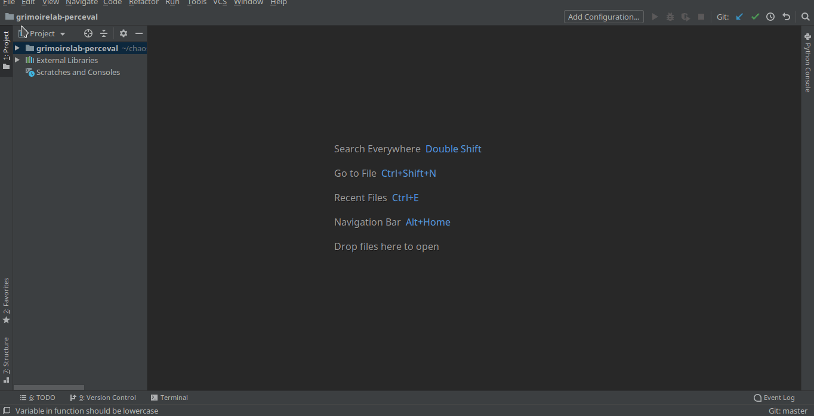

## microtask-1

Set up Perceval to be executed from PyCharm.

1. Download and install [PyCharm IDE](https://www.jetbrains.com/pycharm/).
2. Clone the [grimoirelab-perceval](https://github.com/chaoss/grimoirelab-perceval) repository and open the project using PyCharm.
3. Edit the `Run/Debug configuration` with the following configuration
    - Script path: `bin/perceval`
    - Parameters: the required perceval command
4. Apply the changes and run the script.

---

Here is a small demo

