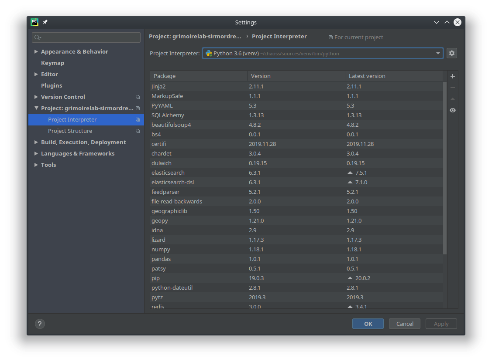
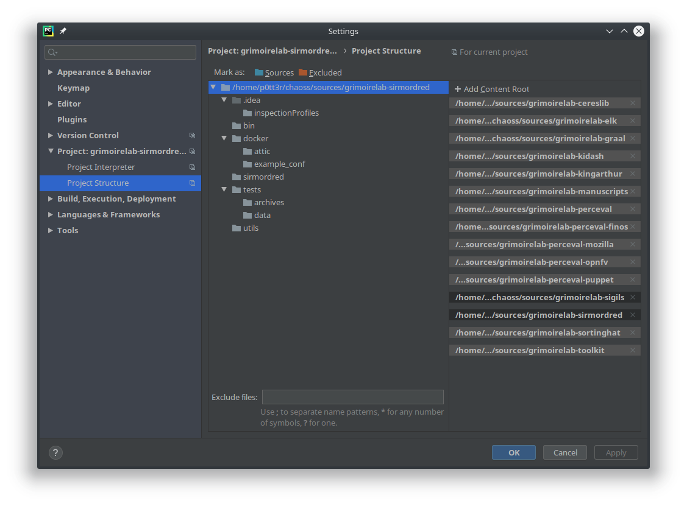
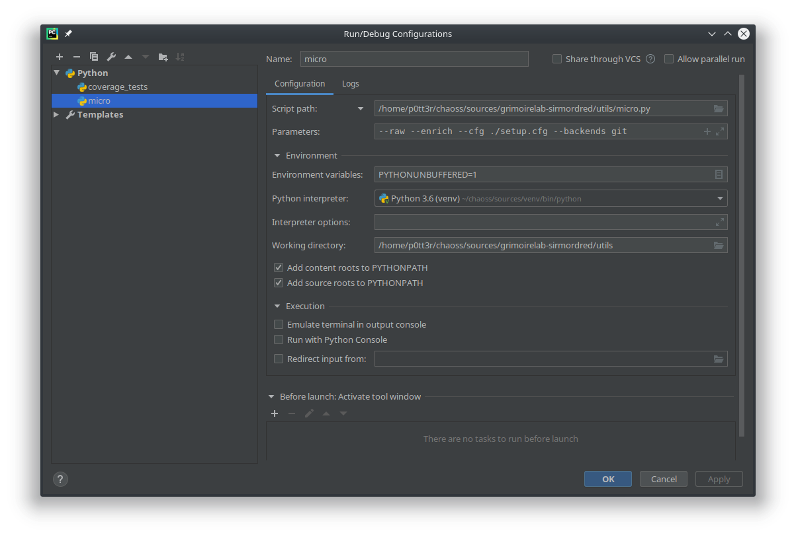

## microtask-4

Set up a dev environment to work on GrimoireLab. [Reference](https://github.com/chaoss/grimoirelab-sirmordred#setting-up-a-pycharm-dev-environment).


1. Fork the required (15 repositories), clone them into `sources` folder and set their respective `upstream` remotes.
This can be completed by using this [script](https://gist.github.com/vchrombie/18cc5f36fe5c934067addf44a487ead9#file-download-sources-sh).
2. Open the `grimoirelab-sirmordred` project with PyCharm and install the required dependencies in the `requirements.txt`, excluding the ones related to the grimoirelab components.
3. The dependencies can be installed by `File >> Settings >> Project:grimoirelab-sirmordred >> Project Interpreter` and select the right interpreter (virtual env).
Click on `+`, top right, to search and install a specific module. Apply the changes.

> **Protip**: You can also check the versions available for that module, click on checkbox `Specify version` and select the required one.
4. The dependencies to the grimoirelab components can be installed by adding them as modules. Go to `File >> Settings >> Project:grimoirelab-sirmordred >> Project Structure`. Then click on `+ Add content root` and add all the grimorelab tools here. Apply the changes.

5. You can verify the setup by running [micro-modred](https://github.com/chaoss/grimoirelab-sirmordred#micro-mordred) which is present in the `utils` folder.
6. Make sure kibiter, elasticsearch and MySQL/MariaDB is running and define a setup.cfg and project.json, which are required for the execution of micro-mordred. I have used the default configurations present in the [utils](https://github.com/chaoss/grimoirelab-sirmordred/tree/master/utils) folder of [grimoirelab-sirmordred](https://github.com/chaoss/grimoirelab-sirmordred). You can find the supported datasources configurations, [here](https://github.com/chaoss/grimoirelab-sirmordred#supported-data-sources).
7. Edit the `Run/Debug configuration` with the following configuration
    - Script path: `/home/p0tt3r/chaoss/sources/grimoirelab-sirmordred/utils/micro.py`
    - Parameters: `--raw --enrich --cfg ./setup.cfg --backends git`
    
8. Apply the changes and run the script.

#### Code:

```
micro.py --raw --enrich --cfg ./setup.cfg --backends git
```
It executes the raw and enrich tasks for the git cfg using the elasticsearch.

```
micro.py --panels --cfg ./setup.cfg
```
It executes the panels task to load the Sigils panels to Kibiter.

#### Result

After executing the above two commands, we get can see the dashboards are created.


