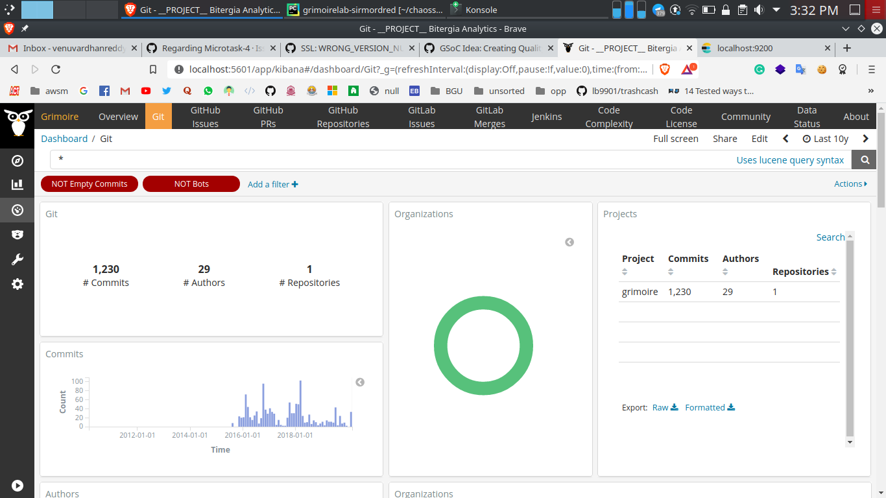

## microtask-4

Set up a dev environment to work on GrimoireLab. [Reference](https://github.com/chaoss/grimoirelab-sirmordred#setting-up-a-pycharm-dev-environment).

We will be discussing the [source code and docker](https://github.com/chaoss/grimoirelab-sirmordred/blob/master/Getting-Started.md#source-code-and-docker-) method of setting up GrimoireLab developer environment. In this method, we use docker for setting up the elasticseach, kibiter (also MariaDB/MySQL if you need). And we will use the source code of the [GrimoireLab components](https://github.com/chaoss/grimoirelab#grimoirelab-components) to build it as a whole project.

### Docker

We are using Docker to build the elasticseach, kibiter (and MariaDB/MySQL). They can be installed by other means too. We are not much concerned about the method they are installed. Docker is the easiest way as it mostly avoids the errors caused by them.

First you need to install docker and docker-compose. You can use these links.
- [How To Install and Use Docker on Ubuntu 18.04 | DigitalOcean](https://www.digitalocean.com/community/tutorials/how-to-install-and-use-docker-on-ubuntu-18-04)
- [Install Docker Compose | Docker Documentation](https://docs.docker.com/compose/install/)

Now, configure a [docker-compose.yml](docker-compose.yml). You can use the file provided (I removed the MariaDB section as I have it working already). Check for the latest configuration from [here](https://github.com/chaoss/grimoirelab-sirmordred/blob/master/Getting-Started.md#docker-compose-with-searchguard-).

docker-compose.yml
```
elasticsearch:
  restart: on-failure:5
  image: bitergia/elasticsearch:6.1.0-secured
  command: elasticsearch -Enetwork.bind_host=0.0.0.0 -Ehttp.max_content_length=2000mb
  environment:
    - ES_JAVA_OPTS=-Xms2g -Xmx2g
  ports:
    - 9200:9200

kibiter:
  restart: on-failure:5
  image: bitergia/kibiter:secured-v6.1.4-5
  environment:
    - PROJECT_NAME=Development
    - NODE_OPTIONS=--max-old-space-size=1000
    - ELASTICSEARCH_URL=https://elasticsearch:9200
    - ELASTICSEARCH_USER=kibanaserver
    - ELASTICSEARCH_PASSWORD=kibanaserver
  links:
    - elasticsearch
  ports:
    - 5601:5601
```

Now that you have the configuration file ready, run it using the below command.

```
docker-compose up -d
```
After this, you would be having the elasticsearch running on `9200` and kibiter on `5601` port numbers respectively. Make sure you have MariaDB/MySQL running too.

### Source Code

We will be using the source code of GrimoireLab components to build it. 

1. Fork the required (15 repositories), clone them into `sources` folder and set their respective `upstream` remotes.
This can be completed by using this [script](https://gist.github.com/vchrombie/18cc5f36fe5c934067addf44a487ead9#file-download-sources-sh).
2. Open the `grimoirelab-sirmordred` project with PyCharm and install the required dependencies in the `requirements.txt`, excluding the ones related to the grimoirelab components.
3. The dependencies can be installed by `File >> Settings >> Project:grimoirelab-sirmordred >> Project Interpreter` and select the right interpreter (virtual env).
Click on `+`, top right, to search and install a specific module. Apply the changes.

> **Protip**: You can also check the versions available for that module, click on checkbox `Specify version` and select the required one.
4. The dependencies to the grimoirelab components can be installed by adding them as modules. Go to `File >> Settings >> Project:grimoirelab-sirmordred >> Project Structure`. Then click on `+ Add content root` and add all the grimorelab tools here. Apply the changes.

5. You can verify the setup by running [micro-modred](https://github.com/chaoss/grimoirelab-sirmordred#micro-mordred) which is present in the `utils` folder.
6. Make sure kibiter, elasticsearch and MySQL/MariaDB is running and define a setup.cfg and project.json, which are required for the execution of micro-mordred. I have used the default configurations present in the [utils](https://github.com/chaoss/grimoirelab-sirmordred/tree/master/utils) folder of [grimoirelab-sirmordred](https://github.com/chaoss/grimoirelab-sirmordred). You can find the supported datasources configurations, [here](https://github.com/chaoss/grimoirelab-sirmordred#supported-data-sources).
7. Edit the `Run/Debug configuration` with the following configuration
    - Script path: `/home/p0tt3r/chaoss/sources/grimoirelab-sirmordred/utils/micro.py`
    - Parameters: `--raw --enrich --cfg ./setup.cfg --backends git`
    
8. Apply the changes and run the script.

#### Code:

```
micro.py --raw --enrich --cfg ./setup.cfg --backends git
```
It executes the raw and enrich tasks for the git cfg using the elasticsearch.

```
micro.py --panels --cfg ./setup.cfg
```
It executes the panels task to load the Sigils panels to Kibiter.

#### Result

After executing the above two commands, we get can see the dashboards are created.


