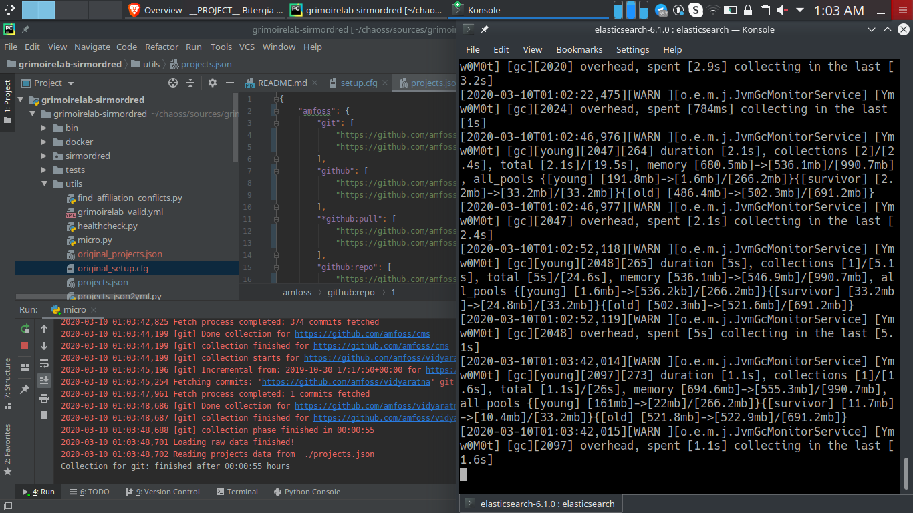
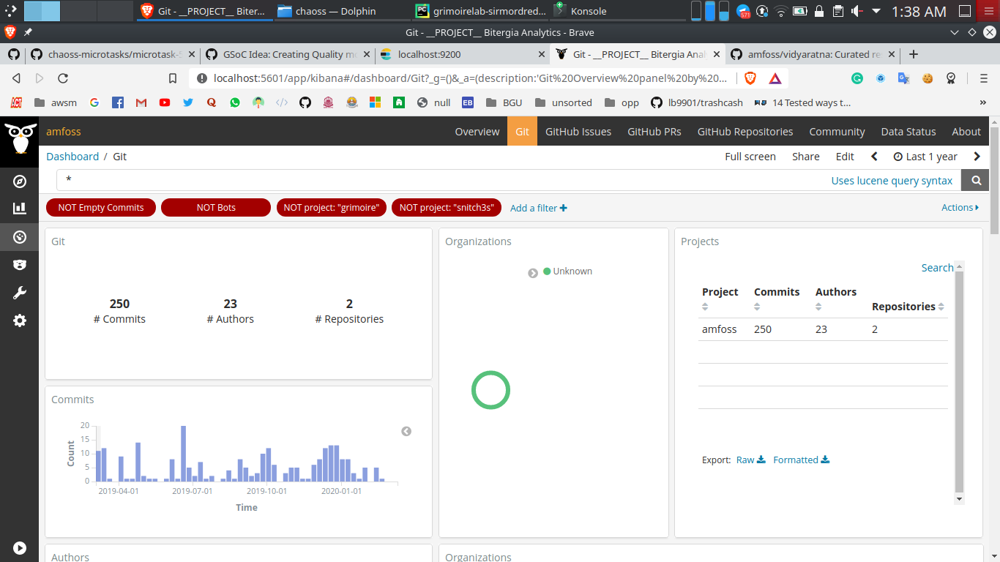
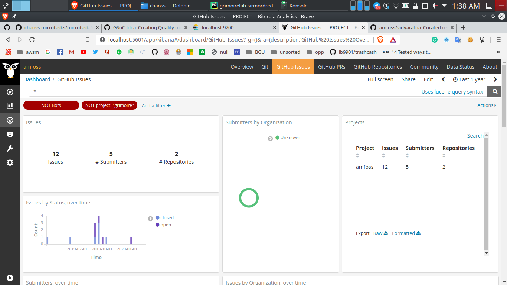
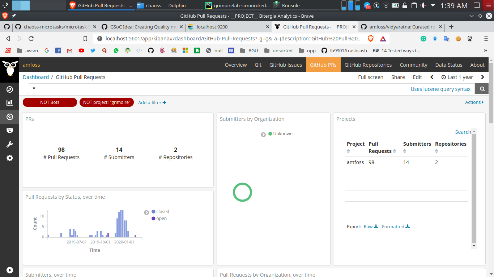

## microtask-5

Execute micro-mordred to collect, enrich and visualize data from Git and GitHub repositories.

The main step for this microtask is to setup the dev environment which is explained in [microtask-4](/microtask-4).

---

The configurations files ([setup.cfg](setup.cfg) and [projects.json](projects.json)) for each backend varies. I have provided the configuration files which I used in the repository (works for only git and github). Here is the [list of supported datasources and it's configurations](https://github.com/chaoss/grimoirelab-sirmordred#supported-data-sources-).

### git

Commits from Git.

projects.json
```
{
    "amfoss": {
        "git": [
            "https://github.com/amfoss/vidyaratna",
            "https://github.com/amfoss/cms"
        ]
    }
}
```

setup.cfg
```
[git]
raw_index = git_chaoss
enriched_index = git_chaoss_enriched
#latest-items = true
category = commit
studies = [enrich_demography:git, enrich_areas_of_code:git, enrich_onion:git]

[enrich_demography:git]
date_field = utc_commit
author_field = author_uuid

[enrich_areas_of_code:git]
#no_incremental = true
in_index = git_chaoss
out_index = git-aoc_chaoss_enriched

[enrich_onion:git]
in_index = git_chaoss_enriched
out_index = git-onion_enriched
contribs_field = hash
no_incremental = false
```

### github

There are three things you can extract from GitHub backend. 
- **issue**
- **pull request**
- **repo** (number of forks, starts, and subscribers in the repository)

projects.json
```
{
    "amfoss": {
        "github": [
            "https://github.com/amfoss/vidyaratna",
            "https://github.com/amfoss/cms"
        ],
        "github:pull": [
            "https://github.com/amfoss/vidyaratna",
            "https://github.com/amfoss/cms"
        ],
        "github:repo": [
            "https://github.com/amfoss/vidyaratna",
            "https://github.com/amfoss/cms"
        ]
    }
}
```

setup.cfg
```
[github]
raw_index = github_issues_chaoss
enriched_index = github_issues_chaoss_enriched
# update the token here
api-token = xxxx
category = issue
sleep-for-rate = true
no-archive = true
sleep-time = 300

[github:pull]
raw_index = github_pulls_chaoss
enriched_index = github_pulls_chaoss_enriched
# update the token here
api-token = xxxx
category = pull_request
sleep-for-rate = true
no-archive = true
sleep-time = 300
studies = [enrich_onion:github]

[github:repo]
raw_index = github_pulls_chaoss
enriched_index = github_repo_enriched
# update the token here
api-token = xxxx
category = repository
no-archive = true

[enrich_onion:github]
#no_incremental = true
in_index_iss = github_issues_chaoss_enriched
in_index_prs = github_pulls_chaoss_enriched
out_index_iss = github_issues_onion-enriched
out_index_prs = github_prs_onion-enriched
data_source_iss = github-issues
data_source_prs = github-prs
```

---

### Code:

Execute the `micro.py` file with the parameters

```
micro.py --raw --enrich --panels --cfg ./setup.cfg --backends github git
```

### Result



#### git



#### github




