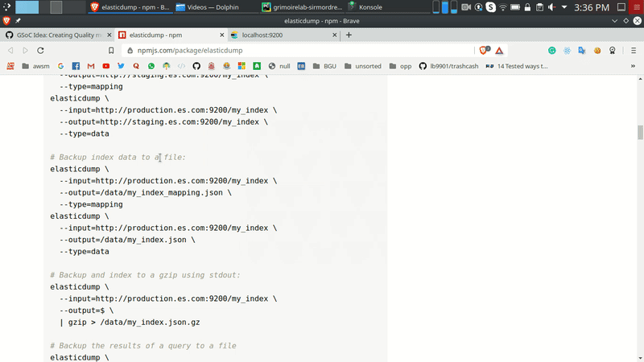

## microtask-7

Install and use [elasticdump](https://www.npmjs.com/package/elasticdump) to download the mapping and data of an ElasticSearch 
index.

I used the index which we extracted in the [microtask-5](/microtask-5), as suggested.

You can use elasticdump to backup index data to a file. You can use the `--type` option to decide what to download 
(default: data, options: [settings, analyzer, data, mapping, alias, template]).

To download the `mapping`.
```
elasticdump --input=http://localhost:9200/git_chaoss_enriched --output=gce_mapping.json --type=mapping
```

To download the `data`.
```
elasticdump --input=http://localhost:9200/git_chaoss_enriched --output=gce_data.json --type=data
```

---

Here is a small demo of downloading the mapping of the index.


