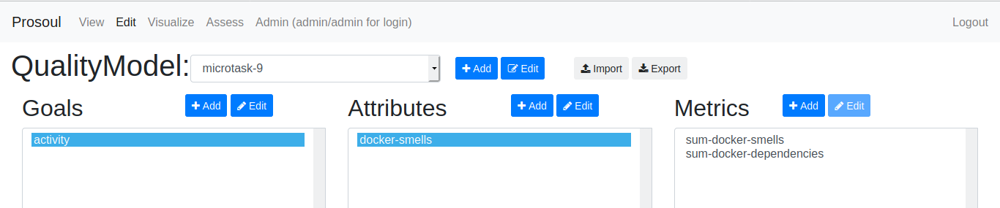

## microtask-9

Create your first Quality Model with Prosoul. Optionally, try perform an assessment with the data at 
https://github.com/valeriocos/prosoul-input-data (it contains a dump of an index and its mapping) to be imported in your 
local instance of ElasticSearch.

First of all, make sure the elasticsearch and kibiter are running on your system. You can use docker for this which is
explained in the [microtask-4](/microtask-4).

1. The main step for this microtask is to setup the [Prosoul](https://github.com/Bitergia/prosoul) which is 
explained in [microtask-8](/microtask-8). I expect that the application is accessible in: http://127.0.0.1:8000/.

2. The next step is to import the index dump to your local instance using [elasticdump](https://www.npmjs.com/package/elasticdump).
You can find some references about this in the [microtask-7](/microtask-7). For now, you can use the script
[upload-all.sh](https://github.com/valeriocos/prosoul-input-data/blob/master/upload-all.sh). Thanks to 
[@valeriocos](https://github.com/valeriocos). :hugs:

3. Create an account in Prosoul. You can create a superuser using this, 
[Creating A Super User In Django | Django Central](https://djangocentral.com/creating-super-user-in-django). 
You can access the Prosoul only after logging in.

4. Any `Quality Model` has one-to-many Goals. Each `Goal` has one-to-many-Atrributes. Each `Attribute` has one-to-many metrics. 
A simple example can be a Developer Quality Model, shown below. 


| Level | Name | Example |
| --- | --- | --- |
| Root | Quality Model | Developer QM |
| Level-1 | Goals | Product, Community |
| Level-2 | Attributes | Vitality, Attention |
| Level-3 | Metrics | numberOfCommits, numberOfIssues, numberOfIssuesAttended, numberOfIssuesClosed |

5. Go to Prosoul Editor, add a Quality Model using the `+ Add` button.
```
Quality Model Name: microtask-9
```

6. You will be asked to add a Goal for the QM. 
```
Goal: activity
```

7. You will be asked to add a Attribute for the Goal.
```
Attribute: docker-smells
```

8. You will be asked to add a metric an Attribute in the Goal in the QM. Each metric has 3 compulsory fields to update.
```
Name: sum-docker-smells
Thresholds: 20,40,60,80,100
Data: docker-smells
```

The `Data` field should be selected from the drop down list of metrics which were imported from the index. Check the below image.


9. Click on `Save` (or `Remove`) after you are done. You can `Add` or `Edit` anything (QM, Goal, Attribute, Metric) using 
the buttons. Make sure you select the parent section, before editing anything. In the end, it should look something like this.
    


10. Once the QM is saved, you can view it in the Prosoul Viewer. Just select the QM from the list and you can view it. Click on
any node to read more about it.


11. Now, we move to Prosoul Visualize. Select the QM from the drop-down list. Make sure your *Elasticsearch URL* and *Kibana URL*
are correct and select the index which was imported using the elasticdump for the field *Index with metrics data*. 
Click on `Create` when you are done.


You would be receiving the result in a couple of minutes. 


You can access the dashboard at http://localhost:5601/app/kibana#/dashboards (Quality Model Dashboard).


12. Let's try doing an Assessment. Go to Prosoul Assessment and fill out the required things. Click on `Create`.


You would be receiving the result in a couple of minutes. 


You can access the dashboard at http://localhost:5601/app/kibana#/dashboards (Assessment Dashboard). You can view the 
assessments as CSV files too, [assessment_csv_lagoon.csv](assessment_csv_lagoon.csv). The [assessment_csv.csv](assessment_csv.csv)
includes the assessment for all the other projects too (lagoon, neo4j, gnomethreads).

You can view the assessment by selecting project (`lagoon` here) from the drop-down list. You can see the values present 
in the CSV file in the picture.


> Protip: You can Import/Export a QM, go to Prosoul Editor and use the buttons and upload/download the QM. 
You can view the QM created in this microtask, [qmodel_microtask-9.json](qmodel_microtask-9.json).
